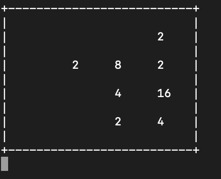
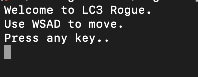
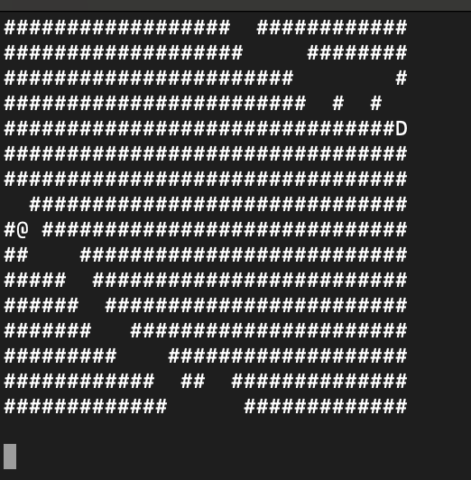

# LC-3 Virtual Machine

> Gati Aher  
> Caitlin Coffey,  
> Navi Boyalakuntla,  
> Zoë McGinnis 

---

## The Project

---

Little Computer 3 (LC-3) is a reduced instruction set computer (RISC). This means that its architecture uses a limited set of optimized instructions to complete tasks in comparison to most modern personal computers (which use a CISC complex instruction set). The fastest computer in the world, Fugaku, also uses the RISC model, as do most smartphones and microprocessors.

LC-3 uses only 15 instructions and 10 registers; these limited memory capabilities make it impractical to run even moderately memory-intensive programs. It is used to introduce computer architecture, virtual machine, and emulator concepts in educational settings.

The objective of this project is to create a virtual machine (VM) in C that can run compiled LC-3 assembly. Given program code in a compiled OBJ file, the VM will be able to execute the instructions in the file. In order to do this, it will use a memory structure defined in the LC-3 specification including program memory, program registers, and condition flags. It will be able to read and write to these memory structures and manage I/O through the terminal.

The final goal of this virtual machine is to run games written in LC-3.

By the completion of this project, we aim to understand the fundamental mechanics of a virtual machine: how processes run in (abstracted) operating systems, how memory structures are implemented given specifications, and how I/O system calls are implemented.

## Implementation

---

### Memory Specification

LC-3 is a register-based virtual machine. This differs from other VMs like the Java VM, which is stack based.

Registers are locations in memory that are easily accessible to the CPU. In this virtual LC-3 implementation, registers are implemented as an array that is indexed with specific enum values. All registers hold 16 bits except for the condition register, which holds 3 bits.

There are 8 general purpose registers, 1 condition register, and the program counter (PC) register. The PC functions as a pointer to the memory location that holds the 16-bit instruction to be executed next. The PC is continuously updated depending on the last instruction to be run.

LC-3 also uses virtual disk space in addition to registers. Virtual disk space is represented by an array with 2^16 locations where each entry stores 16 bits of data. Fig. 1 describes the LC-3 memory map.

There are also 4 memory-mapped registers to handle user input and display to the terminal:

- Keyboard status register (KSR)
- Keyboard data register (KDR)
- Display status register (DSR)
- Display data register (DDR)

These memory-mapped I/O abstractions help incrementally store user input and information to display.


Fig. 1: Memory map of LC-3 VM.

At the beginning of the program loop, all machine instructions are loaded into a portion of memory. The PC starts by pointing to location 0x3000 and is incremented and updated over the course of the program to point to the next instruction in memory to execute.

### Program Execution

LC-3 binaries are formatted in big endian, whereas most modern computer systems use little endian format. For this reason, when loading LC-3 program code, the byte order of each instruction is reversed to convert a big endian program to little endian.

The instructions are then decoded to determine which operation to execute. The first four bits of an instruction, which are known as the opcode, are unique to each operation. The breakdown of the available instructions is shown in Fig. 2. These instructions are broken down using bit shifting and bit masking.

In a physical LC-3 machine, the opcode functionality would be implemented in hardware so that each instruction would take exactly one unit of a clock cycle to execute. However, the virtual implementation runs slower because it is further abstracted from the hardware. Each instruction is treated as an atomic unit (an uninterruptible operation), but it takes longer than a clock cycle to execute.


Fig. 2: Instruction breakdown for instruction decoding.

[Instructions](https://www.notion.so/b1b19e2cfe954a4788b5a4d25ff46dc6)

For further information on these instructions, reference the [specs written by LC-3’s creators](http://highered.mheducation.com/sites/0072467509/student_view0/appendices_a__b__c__d____e.html).

Since there are 15 opcodes represented by 16 serial digits, an enum structure is used to name all possible opcodes. A switch statement is to execute the logic associated with the opcode. In this way, the control unit (CU) and arithmetic logic unit (ALU) components of the CPU are virtualized.

An attempt was made to simulate pipelining, an operation closer to the behavior of hardware for switching between and optimally timing instruction execution functions. This attempt was scrapped due to the complexity that it introduced in the code and no effect in actually speeding up the virtualized execution of opcodes.

The most complex opcode to implement was TRAP. A TRAP system call acts like an interrupting subroutine in that it saves the current PC position, moves the PC to memory locations that contain instructions to execute the syscall, and then returns the PC to the saved position once the syscall completes. In each TRAP instruction is a 8-bit vector which designates which mode of system call to execute. In standard LC-3 models, the TRAP code implementation is stored as a vector table in memory.

[TRAP Vector Syscalls](https://www.notion.so/b27f49e6cee74db8ae58ee79957ed293)

The LC-3 specification states what TRAP should do when called but does not specify how it should be implemented. Thus, in order to simplify a virtual LC-3 implementation, an additional level of abstraction is added that executes the TRAP logic without accessing the TRAP vector table from virtual memory.

Unit tests for the opcodes to ensure that they behaved correctly.

### I/O Handling

TRAP codes are used to handle I/O functionality. Since TRAP system calls do not interact directly with hardware, they must call special functions to communicate with the host operating system in order to access stored user input and write to the terminal correctly. 

As the hardware does not update the input and output storing registers directly, the implementation must have a layer of virtualization to handle setting the keyboard status register and getting the data from the keyboard data register when the LC-3 program code requests it. This abstraction occurs in the `read_from_memory()` function, which also makes use of the `check_key()` function. Here is a snippet of our code from `read_from_memory()`:

```c
uint16_t read_from_memory(uint16_t address)
{
	 if (address == M_KBSR) {
		// check to see if the requested address is for the keyboard status   
		if (check_key()) {     
			// update keyboard status flag to inform LC-3 VM that a new input was entered     
			memory[M_KBSR] = (1 << 15);     
			// update LC-3 VM's latest char from host os' keyboard data register     
			memory[M_KBDR] = getchar();   
		}   
		else {
			// set keyboard status flag back to 0     
			memory[M_KBSR] = 0;   
		} 
	} 
	return memory[address];
}
```

The `check_key()` function asks the OS if a key was pressed since the last check. This function was taken from another LC-3 VM implementation as it is specific to an OS and is boilerplate in order to implement an LC-3 VM.

### Main Loop

Rather than consolidating all the code into one C file, we used multiple C files and header files to speed up the compile time. We use a Makefile to link the OBJ files together when we want to run the program and to recompile any object files that were modified.

In our LC-3 VM’s main function, we follow a classic RISC pipeline, detailed as follows:

1. Load one instruction from memory at the address stored in the program counter register.
2. Isolate the first four bits of the instruction and use a switch statement to determine which operation code it is.
3. Call the corresponding function to execute the operation code.
4. Access the registers and memory to load and store values from the operation code execution.
5. Update the general registers with the output and update condition registers with 100, 010, or 001 value if the final output is negative, zero, or positive, respectively.
6. Increment the program counter.

Here is a snippet of our code that highlights our use of a classic RISC pipeline to execute the operation code:

```c
int main(int argc, const char *argv[])
{
  if (argc <= 1)
  {
	...
  }

  // make it work with unix terminal
  signal(SIGINT, handle_interrupt);
  disable_input_buffering();

  // File path to to program LC-3 should run
  const char *path_to_code = argv[1];
  read_program_code_into_memory(path_to_code);

  /* 0x3000 is the default PC position, start of memory available for user programs. */
  uint16_t PC_INIT = 0x3000;
  reg[R_PC] = PC_INIT;

  while (1)
  {
    uint16_t instruction = read_from_memory(reg[R_PC]++); // load instruction from memory
    uint16_t opcode = instruction >> 12; // look at opcode part of instruction

    switch (opcode) {
... // calling functions here depending on the opcode given
// the functions called will update the general registers + conditional registers
}
```

## Results

---

All code can be found here: [https://github.com/caitlincoffey/SoftSysGarbageEaters](https://github.com/caitlincoffey/SoftSysGarbageEaters)

The VM created is able to run two games: 2048 and Rogue. Both of these games were written in LC-3 assembly. This means that the original goal of this project was accomplished. Credit to [Justin Meiners and Ryan Pendleton](https://github.com/justinmeiners/lc3-vm) for sharing their LC-3 assembly implementations of `rogue.obj` and `2048.obj`.

2048 running in our VM is shown in Fig. 3 and Fig. 4.


Fig. 3: 2048 initial screen



Fig. 4: 2048 game screen

Rogue running in our VM is shown in Fig. 5 and Fig. 6.



Fig. 5: Rogue initial screen



Fig. 6: Rogue game screen.

## Reflection

---

This project met the lower bound discussed earlier in the proposal.

Although this met the lower bound, getting a working VM proved to be a significantly greater feat than initially expected. Debugging the code took a lot more time than anticipated as a single bug could lead to an opcode behaving incorrectly, but the erroneous results would not be evident until a later, different instruction tried to access stored information that did not exist.

Once all of the code was written, we wrote tests for the instruction execution functions. Perhaps, if more tests were introduced incrementally, debugging time might have been shorter.

Another big issue was the set-up for creating LC-3 .obj files. We acquired software to convert .c files into LC-3 big endian assembly files, and then acquired more software to compile those assembly files into .obj program files. However, the conversion software would not run on Ubuntu 20.04 or later versions of Mac. Thus, we could not create a functional way to make our own .obj files. We tested our VM with `2048.obj` and `rogue.obj` files written by [Justin Meiners and Ryan Pendleton](https://github.com/justinmeiners/lc3-vm).

The learning goals of exploring the inner mechanisms of a VM were met. Looking deeper into the LC-3 specification forced us, as a team, to gain additional knowledge of how VMs worked.

## Resources

---

Web simulator for LC-3: [http://wchargin.github.io/lc3web/](http://wchargin.github.io/lc3web/)

Auckland NZ course on LC-3: [https://www.cs.auckland.ac.nz/compsci210s2c/tutorials/tutorial.php?tutorial=4](https://www.cs.auckland.ac.nz/compsci210s2c/tutorials/tutorial.php?tutorial=4)

Really nice diagram for opcode breakdown: [https://www.cs.auckland.ac.nz/compsci210s2c/tutorials/04/InstructionSet.pdf](https://www.cs.auckland.ac.nz/compsci210s2c/tutorials/04/InstructionSet.pdf)

[https://www.cs.utexas.edu/users/fussell/courses/cs310h/lectures/Lecture_10-310h.pdf](https://www.cs.utexas.edu/users/fussell/courses/cs310h/lectures/Lecture_10-310h.pdf) — LC-3 slideshow

[http://highered.mheducation.com/sites/0072467509/student_view0/lc-3_simulator_lab_manual.html](http://highered.mheducation.com/sites/0072467509/student_view0/lc-3_simulator_lab_manual.html) — McGraw-Hill simulator + other resources written by the creators of LC-3 project

[http://highered.mheducation.com/sites/0072467509/student_view0/appendices_a__b**c_*d***_e.html](http://highered.mheducation.com/sites/0072467509/student_view0/appendices_a__b__c__d____e.html) — project specifications

[https://www.cs.colostate.edu/~fsieker/misc/CtoLC3.html](https://www.cs.colostate.edu/~fsieker/misc/CtoLC3.html) — C to LC3 Assembly language

[https://www.cemgokmen.com/programming/2018-10-10-compiling-C-for-LC3/](https://www.cemgokmen.com/programming/2018-10-10-compiling-C-for-LC3/) — C to LC3 Assembly

[https://felixangell.com/blogs/virtual-machine-in-c](https://felixangell.com/blogs/virtual-machine-in-c) — virtual machine in C

[https://justinmeiners.github.io/lc3-vm/](https://justinmeiners.github.io/lc3-vm/) — Write your own virtual machine

[http://journal.stuffwithstuff.com/2013/12/08/babys-first-garbage-collector/](http://journal.stuffwithstuff.com/2013/12/08/babys-first-garbage-collector/) — Baby’s First Garbage Collector

[https://blog.holbertonschool.com/hack-virtual-memory-stack-registers-assembly-code/](https://blog.holbertonschool.com/hack-virtual-memory-stack-registers-assembly-code/) — Hack the virtual memory: the stack, registers and assembly code

[https://github.com/rby90/Project-Based-Tutorials-in-C](https://github.com/rby90/Project-Based-Tutorials-in-C) — Project Based Tutorials in C

## Useful Links

---

Trello: [https://trello.com/b/s83l2eWJ/softsys-garbagecollectors](https://trello.com/b/s83l2eWJ/softsys-garbagecollectors)

Github: [https://github.com/caitlincoffey/SoftSysGarbageEaters](https://github.com/caitlincoffey/SoftSysGarbageEaters)